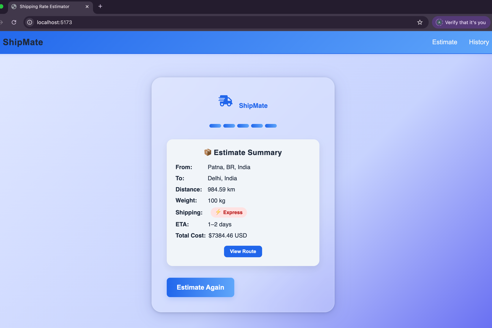
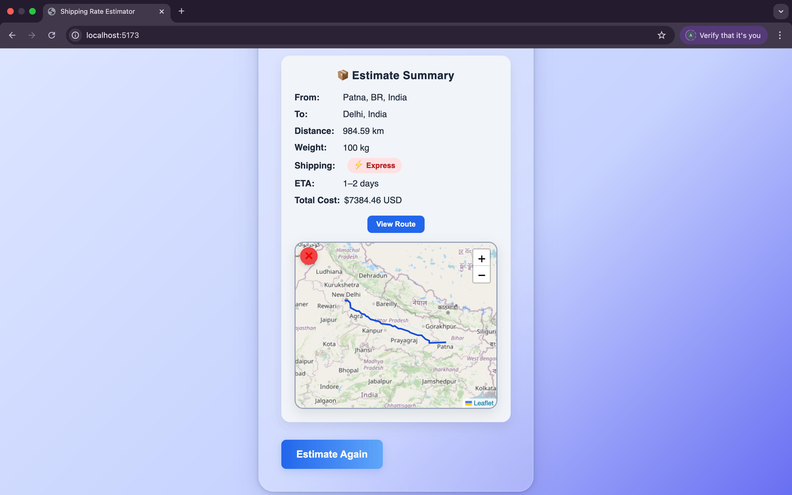

# 📦 Shipping Cost Estimator

A modern, user-friendly shipping cost estimator built with React and OpenRouteService. Easily estimate delivery costs between any two global locations with detailed route info, currency conversion, and distance-based pricing.

---

## ✨ Features

* 🌍 Geocoding using OpenRouteService API
* 🚳 Accurate driving distance between origin and destination
* 💸 Currency conversion with real-time rates (INR, USD, EUR, JPY)
* ⚡ Express and Standard shipping options
* 📏 Weight unit support (kg / lb)
* 🗺 Interactive route map with Leaflet + OpenStreetMap
* 🕒 Estimated delivery time calculation
* 📚 History view of past estimates

---

## 🚀 Live Demo

👉  [Click here to try ShipMate](https://ship-mate-app.vercel.app)

---

## 💪 User Guide

### Step 1: Enter Locations

* Enter your **Origin** (e.g., Delhi, India)
* Enter your **Destination** (e.g., Mumbai, India)

### Step 2: Enter Shipment Details

* **Weight**: Enter a number (e.g., 5) and select **kg** or **lb** from the dropdown
* **Shipping Option**: Choose between **Standard** or **Express**
* **Currency**: Choose the currency for cost output (INR, USD, EUR, JPY)

### Step 3: View Estimate

* Click the **Estimate** button
* You will see the distance, shipping option badge, ETA, and total cost
* Click **View Route** to see the path on the map

### Step 4: Check History

* All previous estimates are saved and can be viewed on the **History Page**

---

## 🤝 Setup Instructions

Clone the repository and run it locally:

```bash
git clone https://github.com/Amankumar-033/ShipMate_App
cd shipping-estimator
npm install
npm run dev
```

### 🔑 Environment Variables

Create a `.env` file in the root with:

```env
VITE_ORS_API_KEY=your_openrouteservice_api_key
VITE_CURRENCY_API_KEY=your_currency_api_key
```

---

## 📸 Screenshots

| Estimate View                           | Interactive Map               |
| --------------------------------------- | ----------------------------- |
|  |  |

---


## 💡 My Approach

* Used **React with TypeScript** for modular development
* **Styled-components** for custom, responsive UI design
* **OpenRouteService** for geocoding, routing, and distance matrix
* **Leaflet + react-leaflet** for route visualization
* Weight input supports **kg** and **lb** with no arrows
* Used **framer-motion** for smooth UI animations
* Each estimate card has a **"View Route"** toggle map view inline

---

## 🛠️ Tech Stack

* **React 18 + TypeScript**
* **Vite**
* **Styled-Components**
* **Framer Motion**
* **OpenRouteService API**
* **Leaflet + React-Leaflet**
* **exchangerate.host** for currency conversion

---

## 📂 Folder Structure

```
src/
├── assets/
│   ├── screenshot1.png
│   └── screenshot2.png
├── components/
│   ├── EstimateForm.tsx
│   ├── HistoryList.tsx
│   ├── Result.tsx
│   └── RouteMapCard.tsx
├── context/
│   └── AppContext.tsx
├── services/
│   └── api.ts
├── styles/
│   └── Global.ts
├── utils/
│   ├── calculation.ts
│   └── constant.ts
├── App.tsx
├── main.tsx

---

## 📽 Optional: Video Walkthrough

[Watch 2-min demo on Loom](https://loom.com/your-recording-url)


## ⚠️ Limitations

- This app uses **OpenRouteService (ORS)** for route calculation.
- ORS only supports **land-based routes** (i.e., routes that are drivable).
- If you enter two locations that **aren’t connected by road** (like New York to Tokyo), the app will detect it and show a helpful message.
- This is intentional to reflect realistic shipping behavior and is gracefully handled in the UI.

